# LSTM Training Flow Documentation

# Tài Liệu Quy Trình Training LSTM

---

## Table of Contents / Mục Lục

- [Overview / Tổng Quan](#overview--tổng-quan)
- [System Architecture / Kiến Trúc Hệ Thống](#system-architecture--kiến-trúc-hệ-thống)
- [Data Collection Flow / Quy Trình Thu Thập Dữ Liệu](#data-collection-flow--quy-trình-thu-thập-dữ-liệu)
- [Auto-Detection System / Hệ Thống Tự Động Phân Tích](#auto-detection-system--hệ-thống-tự-động-phân-tích)
- [Data Preparation Process / Quy Trình Chuẩn Bị Dữ Liệu](#data-preparation-process--quy-trình-chuẩn-bị-dữ-liệu)
- [Model Architecture / Kiến Trúc Mô Hình](#model-architecture--kiến-trúc-mô-hình)
- [Training Process / Quy Trình Training](#training-process--quy-trình-training)
- [Evaluation & Metrics / Đánh Giá & Chỉ Số](#evaluation--metrics--đánh-giá--chỉ-số)
- [Model Saving & Loading / Lưu & Tải Mô Hình](#model-saving--loading--lưu--tải-mô-hình)
- [Usage Examples / Ví Dụ Sử Dụng](#usage-examples--ví-dụ-sử-dụng)
- [Troubleshooting / Xử Lý Sự Cố](#troubleshooting--xử-lý-sự-cố)

---

## Overview / Tổng Quan

### English

The LSTM Training Flow is an intelligent, adaptive system that automatically analyzes stock characteristics and applies the most suitable training strategy for each stock. The system uses auto-detection to classify stocks into different categories (conservative, balanced, aggressive) and applies corresponding features, model architectures, and training parameters.

### Tiếng Việt

Quy Trình Training LSTM là một hệ thống thông minh, tự động thích ứng phân tích đặc điểm cổ phiếu và áp dụng chiến lược training phù hợp nhất cho từng cổ phiếu. Hệ thống sử dụng auto-detection để phân loại cổ phiếu thành các nhóm khác nhau (conservative, balanced, aggressive) và áp dụng các features, kiến trúc mô hình, và tham số training tương ứng.

---

## System Architecture / Kiến Trúc Hệ Thống

### English

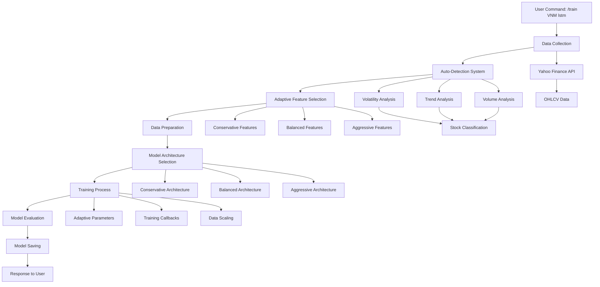

### Tiếng Việt

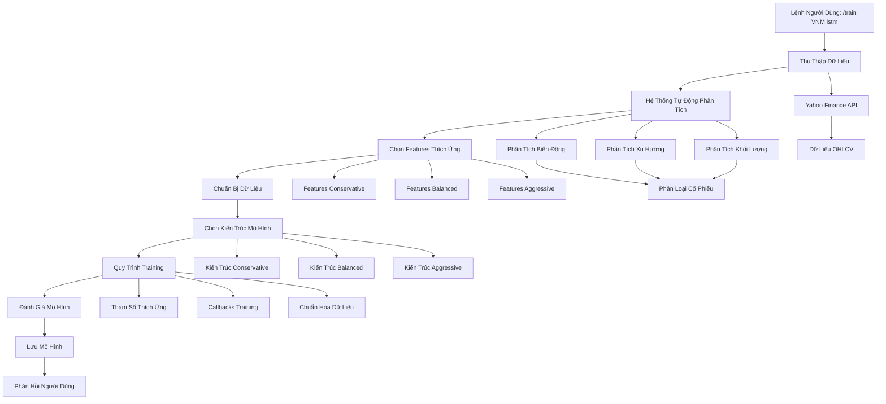

---

## Data Collection Flow / Quy Trình Thu Thập Dữ Liệu

### English

The system automatically determines the data source based on the stock symbol:

1. **VN Market Detection**: Symbols ending with `.VN` or 3-letter codes (VNM, ACB, TCB)
2. **US Market Detection**: Other symbols (AAPL, MSFT, GOOGL)
3. **Data Source**: Yahoo Finance API
4. **Default Period**: 6 months (configurable: 1mo, 3mo, 6mo, 1y, 2y, 5y)

### Training Data Details / Chi Tiết Dữ Liệu Training

#### Data Components / Thành Phần Dữ Liệu

**Raw OHLCV Data (6 months):**

- **Open**: Giá mở cửa hàng ngày
- **High**: Giá cao nhất trong ngày
- **Low**: Giá thấp nhất trong ngày
- **Close**: Giá đóng cửa hàng ngày
- **Volume**: Khối lượng giao dịch

**Technical Indicators (20+ features):**

- **Price Momentum**: Price_Change, Price_Change_2d, Price_Change_5d
- **Moving Averages**: MA_5, MA_10, MA_20, MA_30, MA_50, MA_100
- **RSI Indicators**: RSI_14, Avg_Gain_14, Avg_Loss_14
- **Volume Indicators**: Volume_MA_5, Volume_Ratio, Volume_Change
- **Price Range**: High_Low_Ratio, Close_Open_Ratio
- **Trend Indicators**: Trend_5d, Trend_10d, Trend_20d

**Adaptive Features (based on stock type):**

- **Conservative**: MA_50, MA_100, Stability_Index, Trend_20d
- **Balanced**: MA_30, Momentum_10d, Volatility_15d
- **Aggressive**: MA_15, Volatility_3d, Momentum_5d

#### Data Timeline / Thời Gian Dữ Liệu

**Default Period: 6 months (180 trading days)**

- **Reason**: Balance between data sufficiency and relevance
- **Trading Days**: ~180 days (excluding weekends/holidays)
- **Data Points**: ~180 samples per stock

**Alternative Periods:**

- **1 month**: 20-22 trading days (for quick testing)
- **3 months**: 60-66 trading days (for medium-term patterns)
- **1 year**: 250-252 trading days (for long-term trends)
- **2 years**: 500-504 trading days (for extensive analysis)
- **5 years**: 1250-1260 trading days (for historical patterns)

#### Data Quality Requirements / Yêu Cầu Chất Lượng Dữ Liệu

**Minimum Requirements:**

- **Minimum Data Points**: 100 trading days
- **Data Completeness**: >95% non-missing values
- **Market Coverage**: Regular trading days only

**Data Cleaning Process:**

- Forward fill missing values
- Backward fill remaining gaps
- Remove rows with persistent NaN values
- Ensure chronological order

### Tiếng Việt

Hệ thống tự động xác định nguồn dữ liệu dựa trên mã cổ phiếu:

1. **Phát Hiện Thị Trường VN**: Mã kết thúc bằng `.VN` hoặc mã 3 ký tự (VNM, ACB, TCB)
2. **Phát Hiện Thị Trường Mỹ**: Các mã khác (AAPL, MSFT, GOOGL)
3. **Nguồn Dữ Liệu**: Yahoo Finance API
4. **Khoảng Thời Gian Mặc Định**: 6 tháng (có thể thay đổi: 1mo, 3mo, 6mo, 1y, 2y, 5y)

### Chi Tiết Dữ Liệu Training

#### Thành Phần Dữ Liệu

**Dữ Liệu OHLCV Thô (6 tháng):**

- **Open**: Giá mở cửa hàng ngày
- **High**: Giá cao nhất trong ngày
- **Low**: Giá thấp nhất trong ngày
- **Close**: Giá đóng cửa hàng ngày
- **Volume**: Khối lượng giao dịch

**Chỉ Báo Kỹ Thuật (20+ features):**

- **Momentum Giá**: Price_Change, Price_Change_2d, Price_Change_5d
- **Trung Bình Động**: MA_5, MA_10, MA_20, MA_30, MA_50, MA_100
- **Chỉ Báo RSI**: RSI_14, Avg_Gain_14, Avg_Loss_14
- **Chỉ Báo Khối Lượng**: Volume_MA_5, Volume_Ratio, Volume_Change
- **Phạm Vi Giá**: High_Low_Ratio, Close_Open_Ratio
- **Chỉ Báo Xu Hướng**: Trend_5d, Trend_10d, Trend_20d

**Features Thích Ứng (dựa trên loại cổ phiếu):**

- **Conservative**: MA_50, MA_100, Stability_Index, Trend_20d
- **Balanced**: MA_30, Momentum_10d, Volatility_15d
- **Aggressive**: MA_15, Volatility_3d, Momentum_5d

#### Thời Gian Dữ Liệu

**Khoảng Thời Gian Mặc Định: 6 tháng (180 ngày giao dịch)**

- **Lý Do**: Cân bằng giữa đủ dữ liệu và tính liên quan
- **Ngày Giao Dịch**: ~180 ngày (không tính cuối tuần/ngày lễ)
- **Điểm Dữ Liệu**: ~180 mẫu cho mỗi cổ phiếu

**Khoảng Thời Gian Thay Thế:**

- **1 tháng**: 20-22 ngày giao dịch (cho test nhanh)
- **3 tháng**: 60-66 ngày giao dịch (cho patterns trung hạn)
- **1 năm**: 250-252 ngày giao dịch (cho xu hướng dài hạn)
- **2 năm**: 500-504 ngày giao dịch (cho phân tích sâu)
- **5 năm**: 1250-1260 ngày giao dịch (cho patterns lịch sử)

#### Yêu Cầu Chất Lượng Dữ Liệu

**Yêu Cầu Tối Thiểu:**

- **Điểm Dữ Liệu Tối Thiểu**: 100 ngày giao dịch
- **Độ Hoàn Chỉnh Dữ Liệu**: >95% giá trị không thiếu
- **Phạm Vi Thị Trường**: Chỉ ngày giao dịch thường xuyên

**Quy Trình Làm Sạch Dữ Liệu:**

- Forward fill các giá trị thiếu
- Backward fill các khoảng trống còn lại
- Loại bỏ các hàng có NaN liên tục
- Đảm bảo thứ tự thời gian

### Data Collection Flow Chart / Biểu Đồ Quy Trình Thu Thập Dữ Liệu

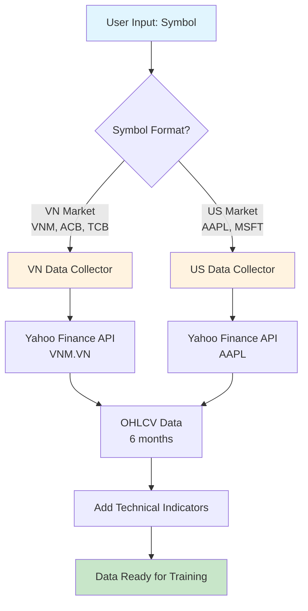

### Data Timeline Visualization / Minh Họa Thời Gian Dữ Liệu

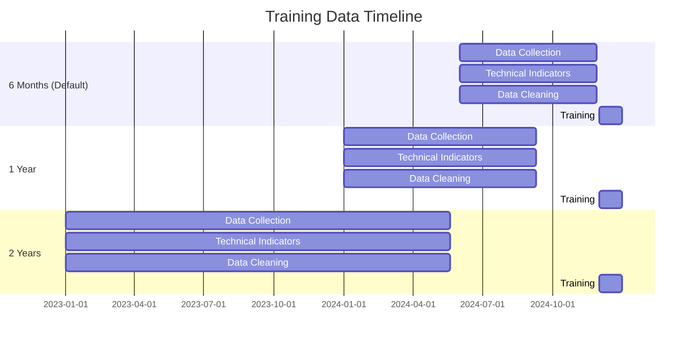

### Data Components Breakdown / Phân Tích Thành Phần Dữ Liệu

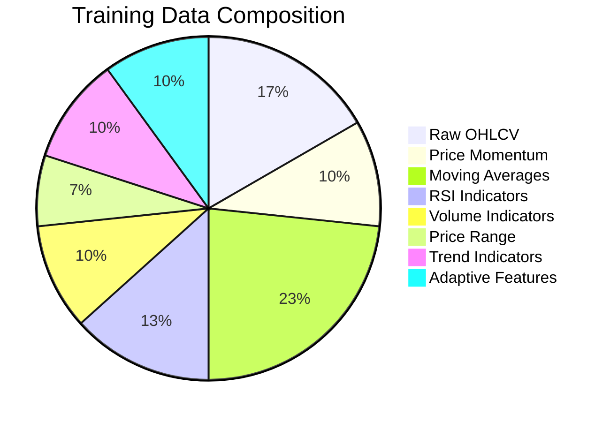

### Code Example / Ví Dụ Code

```python
# VN Market
if symbol.endswith('.VN') or len(symbol) <= 3:
    data = self.vn_collector.get_vn_stock_data_yahoo(symbol, period="6mo")
else:
    # US Market
    data = self.us_collector.get_stock_data(symbol, period="6mo")
```

---

## Auto-Detection System / Hệ Thống Tự Động Phân Tích

### English

The auto-detection system analyzes stock characteristics to determine the optimal training approach:

#### Stock Classification / Phân Loại Cổ Phiếu

- **Conservative**: Annualized volatility < 15% (Blue-chips, FMCG)
- **Balanced**: Annualized volatility 15-25% (Banking, Mid-cap)
- **Aggressive**: Annualized volatility > 25% (High-volatility stocks)

#### Analysis Metrics / Chỉ Số Phân Tích

1. **Volatility Analysis**: Daily and annualized volatility
2. **Price Trend Analysis**: Price range and trend strength
3. **Volume Analysis**: Volume volatility and average volume
4. **Price Stability**: Stability index calculation
5. **Trend Strength**: Short vs long-term moving average comparison

### Tiếng Việt

Hệ thống tự động phân tích đặc điểm cổ phiếu để xác định phương pháp training tối ưu:

#### Phân Loại Cổ Phiếu

- **Conservative**: Biến động hàng năm < 15% (Blue-chips, FMCG)
- **Balanced**: Biến động hàng năm 15-25% (Ngân hàng, Mid-cap)
- **Aggressive**: Biến động hàng năm > 25% (Cổ phiếu biến động cao)

#### Chỉ Số Phân Tích

1. **Phân Tích Biến Động**: Biến động hàng ngày và hàng năm
2. **Phân Tích Xu Hướng Giá**: Phạm vi giá và độ mạnh xu hướng
3. **Phân Tích Khối Lượng**: Biến động khối lượng và khối lượng trung bình
4. **Độ Ổn Định Giá**: Tính toán chỉ số ổn định
5. **Độ Mạnh Xu Hướng**: So sánh trung bình động ngắn hạn vs dài hạn

### Auto-Detection Flow Chart / Biểu Đồ Quy Trình Tự Động Phân Tích

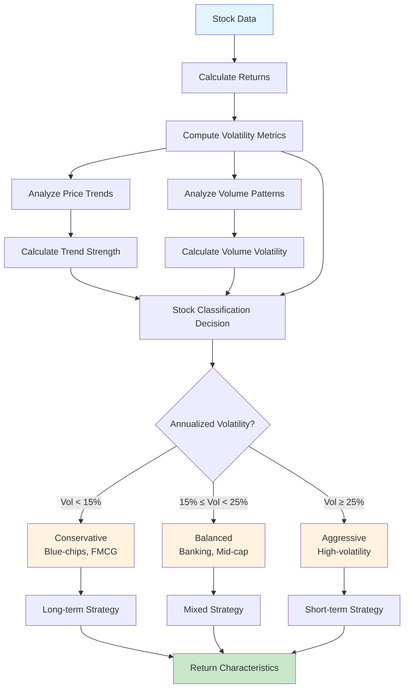

### Code Example / Ví Dụ Code

```python
def analyze_stock_characteristics(self, data: pd.DataFrame, symbol: str):
    returns = data['Close'].pct_change().dropna()
    daily_volatility = returns.std()
    annualized_volatility = daily_volatility * np.sqrt(252)

    if annualized_volatility < 0.15:
        stock_type = 'conservative'
        strategy = 'long_term'
    elif annualized_volatility < 0.25:
        stock_type = 'balanced'
        strategy = 'mixed'
    else:
        stock_type = 'aggressive'
        strategy = 'short_term'

    return {
        'type': stock_type,
        'strategy': strategy,
        'volatility': annualized_volatility
    }
```

---

## Data Preparation Process / Quy Trình Chuẩn Bị Dữ Liệu

### English

The data preparation process involves several steps to ensure high-quality training data:

#### 1. Base Features / Features Cơ Bản

All stocks receive these fundamental features:

- OHLCV data (Open, High, Low, Close, Volume)
- Price momentum (Price_Change, Price_Change_2d, Price_Change_5d)
- Basic moving averages (MA_5, MA_10, MA_20)
- RSI indicators (RSI_14, Avg_Gain_14, Avg_Loss_14)
- Volume indicators (Volume_MA_5, Volume_Ratio)

#### 2. Adaptive Features / Features Thích Ứng

Based on stock classification:

**Conservative Features:**

- Long-term MAs (MA_50, MA_100)
- Stability Index
- Long-term trends (Trend_20d)

**Aggressive Features:**

- Short-term MAs (MA_15)
- Short-term volatility (Volatility_3d)
- Momentum indicators (Momentum_5d)

**Balanced Features:**

- Medium-term MAs (MA_30)
- Medium-term momentum (Momentum_10d)
- Medium-term volatility (Volatility_15d)

#### 3. Data Cleaning / Làm Sạch Dữ Liệu

- Forward fill NaN values
- Backward fill remaining NaN values
- Drop rows with remaining NaN values

#### 4. Sequence Creation / Tạo Chuỗi Dữ Liệu

- Create input sequences (X) with lookback period
- Create target sequences (y) with prediction horizon
- Ensure proper shapes for LSTM training

### Tiếng Việt

Quy trình chuẩn bị dữ liệu bao gồm nhiều bước để đảm bảo dữ liệu training chất lượng cao:

#### 1. Features Cơ Bản

Tất cả cổ phiếu đều nhận các features cơ bản này:

- Dữ liệu OHLCV (Open, High, Low, Close, Volume)
- Momentum giá (Price_Change, Price_Change_2d, Price_Change_5d)
- Trung bình động cơ bản (MA_5, MA_10, MA_20)
- Chỉ báo RSI (RSI_14, Avg_Gain_14, Avg_Loss_14)
- Chỉ báo khối lượng (Volume_MA_5, Volume_Ratio)

#### 2. Features Thích Ứng

Dựa trên phân loại cổ phiếu:

**Features Conservative:**

- Trung bình động dài hạn (MA_50, MA_100)
- Chỉ số ổn định
- Xu hướng dài hạn (Trend_20d)

**Features Aggressive:**

- Trung bình động ngắn hạn (MA_15)
- Biến động ngắn hạn (Volatility_3d)
- Chỉ báo momentum (Momentum_5d)

**Features Balanced:**

- Trung bình động trung hạn (MA_30)
- Momentum trung hạn (Momentum_10d)
- Biến động trung hạn (Volatility_15d)

#### 3. Làm Sạch Dữ Liệu

- Forward fill các giá trị NaN
- Backward fill các giá trị NaN còn lại
- Loại bỏ các hàng còn NaN

#### 4. Tạo Chuỗi Dữ Liệu

- Tạo chuỗi đầu vào (X) với khoảng thời gian lookback
- Tạo chuỗi mục tiêu (y) với khoảng thời gian dự báo
- Đảm bảo shape phù hợp cho training LSTM

### Data Preparation Flow Chart / Biểu Đồ Quy Trình Chuẩn Bị Dữ Liệu

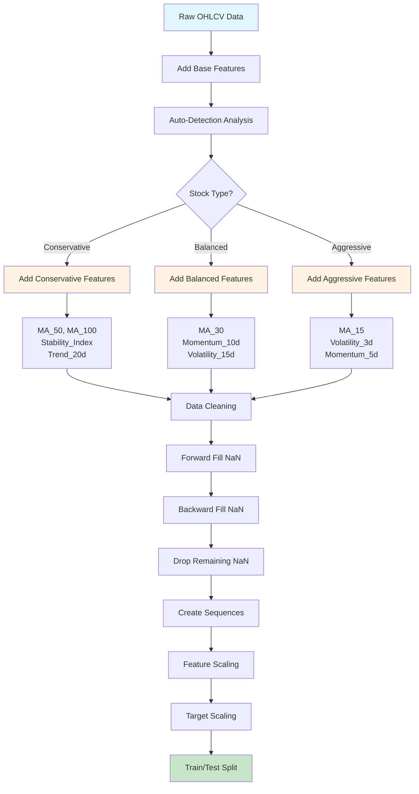

### Code Example / Ví Dụ Code

```python
def prepare_data(self, data, target_col='Close', lookback=30, symbol=''):
    # Auto-detect characteristics
    characteristics = self.analyze_stock_characteristics(data, symbol)
    stock_type = characteristics.get('type', 'balanced')

    # Add base features
    data_enhanced['Price_Change'] = data_enhanced['Close'].pct_change()
    data_enhanced['MA_5'] = data_enhanced['Close'].rolling(window=5).mean()

    # Add adaptive features
    if stock_type == 'conservative':
        data_enhanced['MA_50'] = data_enhanced['Close'].rolling(window=50).mean()
        data_enhanced['Stability_Index'] = 1 / (1 + data_enhanced['Volatility_20d'])
    elif stock_type == 'aggressive':
        data_enhanced['MA_15'] = data_enhanced['Close'].rolling(window=15).mean()
        data_enhanced['Volatility_3d'] = data_enhanced['Price_Change'].rolling(window=3).std()

    # Create sequences
    for i in range(lookback, len(data_clean) - prediction_horizon + 1):
        X.append(feature_data[i-lookback:i])
        y.append(target_data[i:i+prediction_horizon])
```

---

## Model Architecture / Kiến Trúc Mô Hình

### English

The model architecture adapts based on stock characteristics:

#### Conservative Architecture (VNM, Blue-chips)

```python
Input Layer
↓
LSTM(32, return_sequences=True) → BatchNormalization → Dropout(0.1)
↓
LSTM(16, return_sequences=False) → BatchNormalization → Dropout(0.1)
↓
Dense(16, activation='relu') → BatchNormalization → Dropout(0.05)
↓
Dense(output_size)
```

#### Aggressive Architecture (High-volatility stocks)

```python
Input Layer
↓
LSTM(128, return_sequences=True) → BatchNormalization → Dropout(0.3)
↓
LSTM(64, return_sequences=True) → BatchNormalization → Dropout(0.3)
↓
LSTM(32, return_sequences=False) → BatchNormalization → Dropout(0.2)
↓
Dense(64, activation='relu') → BatchNormalization → Dropout(0.2)
↓
Dense(32, activation='relu') → BatchNormalization → Dropout(0.1)
↓
Dense(output_size)
```

#### Balanced Architecture (Banking stocks)

```python
Input Layer
↓
LSTM(64, return_sequences=True) → BatchNormalization → Dropout(0.2)
↓
LSTM(32, return_sequences=False) → BatchNormalization → Dropout(0.2)
↓
Dense(32, activation='relu') → BatchNormalization → Dropout(0.1)
↓
Dense(16, activation='relu') → BatchNormalization → Dropout(0.1)
↓
Dense(output_size)
```

### Tiếng Việt

Kiến trúc mô hình thích ứng dựa trên đặc điểm cổ phiếu:

#### Kiến Trúc Conservative (VNM, Blue-chips)

- Ít layer hơn, ít dropout hơn
- Learning rate cao hơn (0.002)
- Phù hợp với cổ phiếu ổn định

#### Kiến Trúc Aggressive (Cổ phiếu biến động cao)

- Nhiều layer hơn, nhiều dropout hơn
- Learning rate thấp hơn (0.0005)
- Phù hợp với cổ phiếu biến động mạnh

#### Kiến Trúc Balanced (Cổ phiếu ngân hàng)

- Kiến trúc cân bằng
- Learning rate trung bình (0.001)
- Phù hợp với cổ phiếu biến động vừa phải

### Model Architecture Flow Chart / Biểu Đồ Kiến Trúc Mô Hình

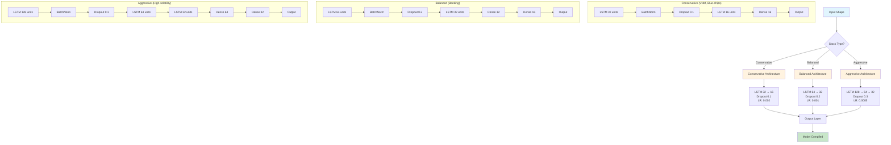

### Code Example / Ví Dụ Code

```python
def build_lstm_model(self, input_shape, output_size, symbol='', characteristics=None):
    model = Sequential()
    model.add(Input(shape=input_shape))

    if characteristics:
        stock_type = characteristics.get('type', 'balanced')
        volatility = characteristics.get('volatility', 0.2)

    if stock_type == 'conservative':
        model.add(LSTM(32, return_sequences=True))
        model.add(BatchNormalization())
        model.add(Dropout(0.1))
        learning_rate = 0.002
    elif stock_type == 'aggressive':
        model.add(LSTM(128, return_sequences=True))
        model.add(BatchNormalization())
        model.add(Dropout(0.3))
        learning_rate = 0.0005
    else:
        model.add(LSTM(64, return_sequences=True))
        model.add(BatchNormalization())
        model.add(Dropout(0.2))
        learning_rate = 0.001

    optimizer = Adam(learning_rate=learning_rate, clipnorm=1.0)
    model.compile(optimizer=optimizer, loss='mse', metrics=['mae'])
    return model
```

---

## Training Process / Quy Trình Training

### English

The training process uses adaptive parameters based on stock characteristics:

#### Adaptive Parameters / Tham Số Thích Ứng

**Conservative Stocks:**

- Epochs: 80
- Batch Size: 32
- Lookback: 40
- Patience: 15

**Aggressive Stocks:**

- Epochs: 150
- Batch Size: 8
- Lookback: 25
- Patience: 25

**Balanced Stocks:**

- Epochs: 100
- Batch Size: 16
- Lookback: 30
- Patience: 20

#### Training Callbacks / Callbacks Training

```python
early_stopping = EarlyStopping(
    monitor='val_loss',
    patience=20,
    restore_best_weights=True,
    min_delta=1e-5
)

reduce_lr = ReduceLROnPlateau(
    monitor='val_loss',
    factor=0.5,
    patience=10,
    min_lr=1e-7,
    verbose=1
)
```

#### Data Scaling / Chuẩn Hóa Dữ Liệu

- **Feature Scaling**: StandardScaler for input features
- **Target Scaling**: StandardScaler for target values
- **Inverse Transform**: For accurate evaluation metrics

### Tiếng Việt

Quy trình training sử dụng tham số thích ứng dựa trên đặc điểm cổ phiếu:

#### Tham Số Thích Ứng

**Cổ Phiếu Conservative:**

- Epochs: 80 (ít epochs hơn do ổn định)
- Batch Size: 32 (batch lớn hơn)
- Lookback: 40 (nhìn xa hơn)
- Patience: 15 (dừng sớm hơn)

**Cổ Phiếu Aggressive:**

- Epochs: 150 (nhiều epochs hơn do phức tạp)
- Batch Size: 8 (batch nhỏ hơn)
- Lookback: 25 (nhìn gần hơn)
- Patience: 25 (dừng muộn hơn)

**Cổ Phiếu Balanced:**

- Epochs: 100 (trung bình)
- Batch Size: 16 (trung bình)
- Lookback: 30 (trung bình)
- Patience: 20 (trung bình)

#### Callbacks Training

- **Early Stopping**: Dừng sớm khi không cải thiện
- **Reduce Learning Rate**: Giảm learning rate khi plateau
- **Restore Best Weights**: Khôi phục weights tốt nhất

#### Chuẩn Hóa Dữ Liệu

- **Feature Scaling**: StandardScaler cho features đầu vào
- **Target Scaling**: StandardScaler cho giá trị mục tiêu
- **Inverse Transform**: Để tính metrics chính xác

### Training Process Flow Chart / Biểu Đồ Quy Trình Training

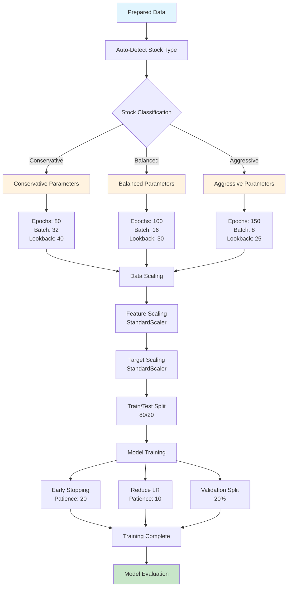

### Training Parameters Comparison / So Sánh Tham Số Training

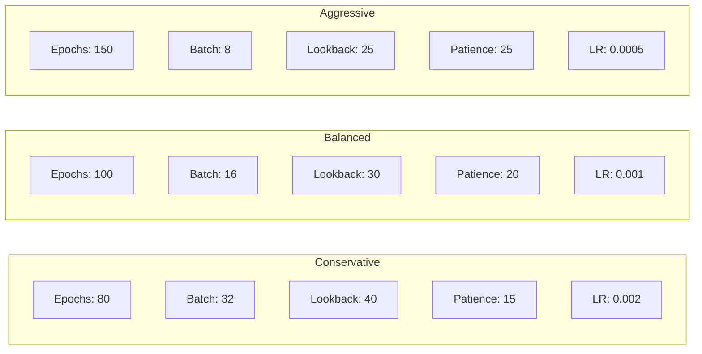

### Code Example / Ví Dụ Code

```python
def train_lstm_model(self, data, symbol, lookback=30, epochs=100, batch_size=16):
    # Auto-detect characteristics
    characteristics = self.analyze_stock_characteristics(data, symbol)
    stock_type = characteristics.get('type', 'balanced')

    # Adaptive parameters
    if stock_type == 'conservative':
        adaptive_epochs = 80
        adaptive_batch_size = 32
        adaptive_lookback = 40
    elif stock_type == 'aggressive':
        adaptive_epochs = 150
        adaptive_batch_size = 8
        adaptive_lookback = 25
    else:
        adaptive_epochs = 100
        adaptive_batch_size = 16
        adaptive_lookback = 30

    # Scale data
    X_train_scaled = self.lstm_scaler.fit_transform(X_train)
    y_train_scaled = self.target_scaler.fit_transform(y_train)

    # Train model
    history = model.fit(
        X_train_scaled, y_train_scaled,
        epochs=adaptive_epochs,
        batch_size=adaptive_batch_size,
        validation_split=0.2,
        callbacks=[early_stopping, reduce_lr],
        verbose=1
    )
```

---

## Evaluation & Metrics / Đánh Giá & Chỉ Số

### English

The system evaluates model performance using multiple metrics:

#### Evaluation Metrics / Chỉ Số Đánh Giá

1. **Mean Squared Error (MSE)**: Measures prediction accuracy
2. **Mean Absolute Error (MAE)**: Measures average prediction error
3. **R-squared (R²)**: Measures how well the model explains variance

#### Metric Interpretation / Giải Thích Chỉ Số

**MSE (Mean Squared Error):**

- Lower is better
- Measures squared difference between predictions and actual values
- Sensitive to outliers

**MAE (Mean Absolute Error):**

- Lower is better
- Measures absolute difference between predictions and actual values
- Less sensitive to outliers than MSE

**R² (R-squared):**

- Range: -∞ to 1.0
- 1.0 = Perfect prediction
- 0.0 = Model performs as well as predicting the mean
- Negative = Model performs worse than predicting the mean

#### Expected Performance / Hiệu Suất Mong Đợi

**Conservative Stocks (VNM, Blue-chips):**

- MSE: 1,000,000 - 5,000,000
- MAE: 500 - 2,000
- R²: 0.1 - 0.4

**Balanced Stocks (Banking):**

- MSE: 2,000,000 - 10,000,000
- MAE: 1,000 - 3,000
- R²: 0.2 - 0.5

**Aggressive Stocks (High-volatility):**

- MSE: 5,000,000 - 20,000,000
- MAE: 2,000 - 5,000
- R²: 0.1 - 0.3

### Tiếng Việt

Hệ thống đánh giá hiệu suất mô hình bằng nhiều chỉ số:

#### Chỉ Số Đánh Giá

1. **Mean Squared Error (MSE)**: Đo độ chính xác dự báo
2. **Mean Absolute Error (MAE)**: Đo sai số dự báo trung bình
3. **R-squared (R²)**: Đo mức độ mô hình giải thích biến động

#### Giải Thích Chỉ Số

**MSE (Mean Squared Error):**

- Càng thấp càng tốt
- Đo bình phương sai số giữa dự báo và giá trị thực
- Nhạy cảm với outliers

**MAE (Mean Absolute Error):**

- Càng thấp càng tốt
- Đo sai số tuyệt đối giữa dự báo và giá trị thực
- Ít nhạy cảm với outliers hơn MSE

**R² (R-squared):**

- Phạm vi: -∞ đến 1.0
- 1.0 = Dự báo hoàn hảo
- 0.0 = Mô hình tốt bằng việc dự báo giá trị trung bình
- Âm = Mô hình kém hơn việc dự báo giá trị trung bình

#### Hiệu Suất Mong Đợi

**Cổ Phiếu Conservative (VNM, Blue-chips):**

- MSE: 1,000,000 - 5,000,000
- MAE: 500 - 2,000
- R²: 0.1 - 0.4

**Cổ Phiếu Balanced (Ngân hàng):**

- MSE: 2,000,000 - 10,000,000
- MAE: 1,000 - 3,000
- R²: 0.2 - 0.5

**Cổ Phiếu Aggressive (Biến động cao):**

- MSE: 5,000,000 - 20,000,000
- MAE: 2,000 - 5,000
- R²: 0.1 - 0.3

### Evaluation Flow Chart / Biểu Đồ Quy Trình Đánh Giá

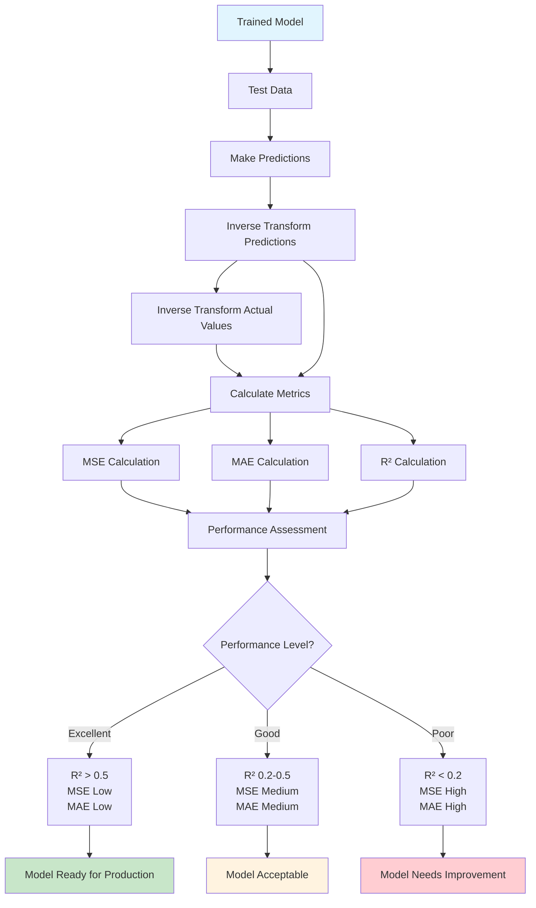

### Expected Performance Ranges / Phạm Vi Hiệu Suất Mong Đợi

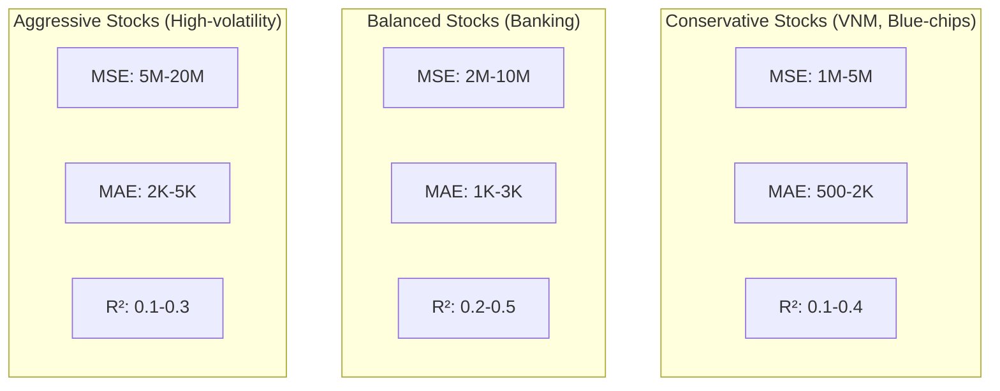

### Code Example / Ví Dụ Code

```python
def evaluate_model(self, model, X_test_scaled, y_test_scaled):
    # Make predictions
    y_pred_scaled = model.predict(X_test_scaled, batch_size=1, verbose=0)

    # Inverse transform for evaluation
    y_pred_inverse = self.target_scaler.inverse_transform(y_pred_scaled.reshape(-1, y_pred_scaled.shape[-1]))
    y_test_inverse = self.target_scaler.inverse_transform(y_test_scaled.reshape(-1, y_test_scaled.shape[-1]))

    # Reshape for metrics calculation
    y_pred_flat = y_pred_inverse.reshape(-1)
    y_test_flat = y_test_inverse.reshape(-1)

    # Calculate metrics
    mse = mean_squared_error(y_test_flat, y_pred_flat)
    mae = mean_absolute_error(y_test_flat, y_pred_flat)
    r2 = r2_score(y_test_flat, y_pred_flat)

    return {
        'mse': mse,
        'mae': mae,
        'r2': r2
    }
```

---

## Model Saving & Loading / Lưu & Tải Mô Hình

### English

The system saves trained models and associated components for later use:

#### Saved Components / Thành Phần Được Lưu

1. **LSTM Model**: `.h5` format (Keras model)
2. **Feature Scaler**: `.pkl` format (StandardScaler for input features)
3. **Target Scaler**: `.pkl` format (StandardScaler for target values)
4. **Training Metadata**: JSON format (training parameters, performance metrics)

#### File Naming Convention / Quy Ước Đặt Tên File

```
models/
├── lstm_model_VNM.h5
├── lstm_scaler_VNM.pkl
├── lstm_target_scaler_VNM.pkl
├── lstm_metadata_VNM.json
├── lstm_model_ACB.h5
├── lstm_scaler_ACB.pkl
└── ...
```

#### Loading Process / Quy Trình Tải

1. Load the trained model
2. Load feature scaler
3. Load target scaler
4. Load training metadata
5. Verify model compatibility

### Tiếng Việt

Hệ thống lưu các mô hình đã training và các thành phần liên quan để sử dụng sau:

#### Thành Phần Được Lưu

1. **Mô Hình LSTM**: Định dạng `.h5` (Keras model)
2. **Feature Scaler**: Định dạng `.pkl` (StandardScaler cho features đầu vào)
3. **Target Scaler**: Định dạng `.pkl` (StandardScaler cho giá trị mục tiêu)
4. **Metadata Training**: Định dạng JSON (tham số training, chỉ số hiệu suất)

#### Quy Ước Đặt Tên File

```
models/
├── lstm_model_VNM.h5
├── lstm_scaler_VNM.pkl
├── lstm_target_scaler_VNM.pkl
├── lstm_metadata_VNM.json
├── lstm_model_ACB.h5
├── lstm_scaler_ACB.pkl
└── ...
```

#### Quy Trình Tải

1. Tải mô hình đã training
2. Tải feature scaler
3. Tải target scaler
4. Tải metadata training
5. Xác minh tính tương thích mô hình

### Model Saving & Loading Flow Chart / Biểu Đồ Lưu & Tải Mô Hình

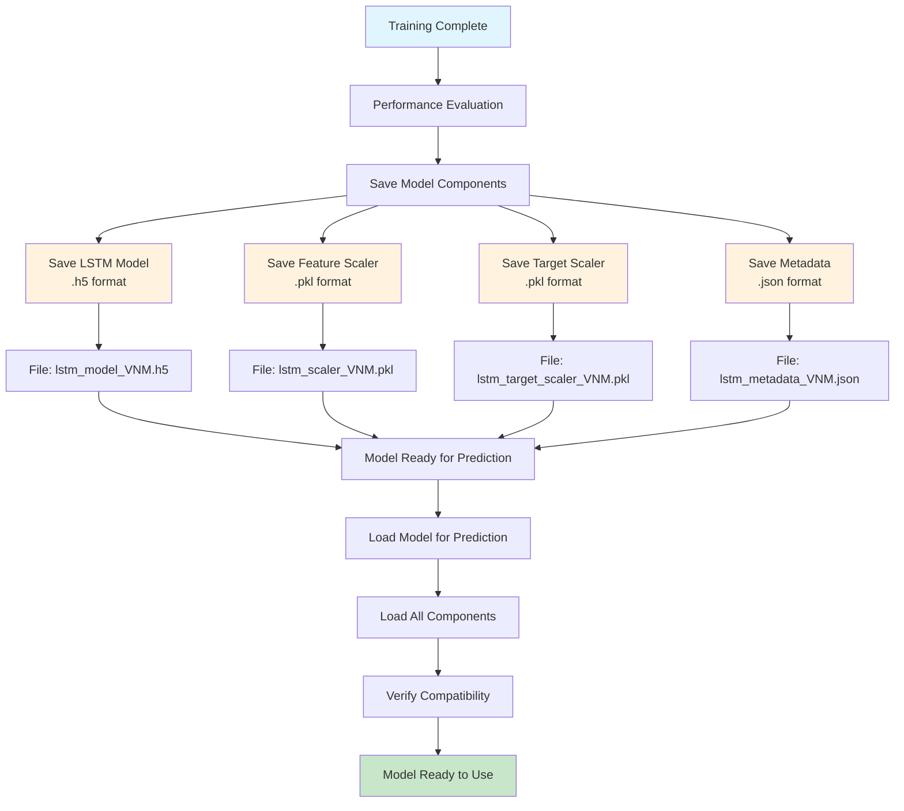

### File Structure / Cấu Trúc File

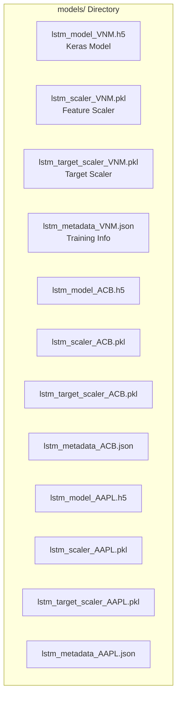

### Code Example / Ví Dụ Code

```python
def save_model(self, model, symbol):
    # Create models directory
    os.makedirs(self.model_save_path, exist_ok=True)

    # Save model
    model_path = os.path.join(self.model_save_path, f"lstm_model_{symbol}.h5")
    model.save(model_path)

    # Save scalers
    scaler_path = os.path.join(self.model_save_path, f"lstm_scaler_{symbol}.pkl")
    target_scaler_path = os.path.join(self.model_save_path, f"lstm_target_scaler_{symbol}.pkl")

    joblib.dump(self.lstm_scaler, scaler_path)
    joblib.dump(self.target_scaler, target_scaler_path)

    # Save metadata
    metadata = {
        'symbol': symbol,
        'model_type': 'lstm',
        'training_date': datetime.now().isoformat(),
        'performance': {
            'mse': mse,
            'mae': mae,
            'r2': r2
        }
    }

    metadata_path = os.path.join(self.model_save_path, f"lstm_metadata_{symbol}.json")
    with open(metadata_path, 'w') as f:
        json.dump(metadata, f, indent=2)

def load_model(self, symbol):
    # Load model
    model_path = os.path.join(self.model_save_path, f"lstm_model_{symbol}.h5")
    model = tf.keras.models.load_model(model_path)

    # Load scalers
    scaler_path = os.path.join(self.model_save_path, f"lstm_scaler_{symbol}.pkl")
    target_scaler_path = os.path.join(self.model_save_path, f"lstm_target_scaler_{symbol}.pkl")

    self.lstm_scaler = joblib.load(scaler_path)
    self.target_scaler = joblib.load(target_scaler_path)

    return model
```

---

## Usage Examples / Ví Dụ Sử Dụng

### English

Here are examples of how to use the LSTM training system:

#### Basic Training / Training Cơ Bản

```bash
# Train LSTM model for VNM
/train VNM lstm

# Train LSTM model for ACB
/train ACB lstm

# Train LSTM model for US stock
/train AAPL lstm
```

## Pre-Training vs Post-Training Functions / Chức Năng Trước và Sau Training

### English

The system can operate both before and after training, but with different data sources and methods:

#### Pre-Training Mode (Default) / Chế Độ Trước Training

**Data Sources:**

- **Real-time Market Data**: Live data from Yahoo Finance API
- **Technical Analysis**: Pre-calculated indicators
- **Statistical Models**: Simple regression and time series models
- **Market Sentiment**: News and social media analysis

**Available Functions:**

- Basic price predictions using statistical models
- Technical analysis with standard indicators
- Market sentiment analysis
- Risk assessment using historical volatility

#### Post-Training Mode (Enhanced) / Chế Độ Sau Training

**Data Sources:**

- **Trained LSTM Models**: Custom models for each stock
- **Enhanced Features**: Auto-detected adaptive features
- **Historical Patterns**: Learned from training data
- **Real-time Predictions**: Using trained models

**Available Functions:**

- Advanced price predictions with LSTM models
- Trading signals based on learned patterns
- Portfolio analysis with trained models
- Risk assessment using model predictions

### Tiếng Việt

Hệ thống có thể hoạt động cả trước và sau khi training, nhưng với nguồn dữ liệu và phương pháp khác nhau:

#### Chế Độ Trước Training (Mặc Định)

**Nguồn Dữ Liệu:**

- **Dữ Liệu Thị Trường Real-time**: Dữ liệu trực tiếp từ Yahoo Finance API
- **Phân Tích Kỹ Thuật**: Các chỉ báo được tính toán sẵn
- **Mô Hình Thống Kê**: Mô hình hồi quy và chuỗi thời gian đơn giản
- **Tâm Lý Thị Trường**: Phân tích tin tức và mạng xã hội

**Chức Năng Có Sẵn:**

- Dự báo giá cơ bản sử dụng mô hình thống kê
- Phân tích kỹ thuật với chỉ báo chuẩn
- Phân tích tâm lý thị trường
- Đánh giá rủi ro sử dụng biến động lịch sử

#### Chế Độ Sau Training (Nâng Cao)

**Nguồn Dữ Liệu:**

- **Mô Hình LSTM Đã Training**: Mô hình tùy chỉnh cho từng cổ phiếu
- **Features Nâng Cao**: Features thích ứng tự động phát hiện
- **Patterns Lịch Sử**: Học từ dữ liệu training
- **Dự Báo Real-time**: Sử dụng mô hình đã training

**Chức Năng Có Sẵn:**

- Dự báo giá nâng cao với mô hình LSTM
- Tín hiệu giao dịch dựa trên patterns đã học
- Phân tích danh mục với mô hình đã training
- Đánh giá rủi ro sử dụng dự báo mô hình

## Post-Training Functions / Chức Năng Sau Training

### English

After training, the LSTM model enables several key functions:

#### 1. Price Prediction / Dự Báo Giá

**Function**: `/predict <symbol> lstm`
**Purpose**: Predict future stock prices
**Output**: Predicted price, expected change, confidence level

**Example**:

```bash
/predict VNM lstm
# Output: Predicted price for next 1-5 days
```

#### 2. Portfolio Analysis / Phân Tích Danh Mục

**Function**: `/portfolio <symbols>`
**Purpose**: Analyze multiple stocks with trained models
**Output**: Risk assessment, diversification recommendations

**Example**:

```bash
/portfolio VNM ACB TCB
# Output: Portfolio risk analysis using trained models
```

#### 3. Trading Signals / Tín Hiệu Giao Dịch

**Function**: `/signals <symbol>`
**Purpose**: Generate buy/sell signals based on predictions
**Output**: Trading recommendations with confidence levels

**Example**:

```bash
/signals VNM
# Output: Buy/Sell signals with price targets
```

#### 4. Risk Assessment / Đánh Giá Rủi Ro

**Function**: `/risk <symbol>`
**Purpose**: Assess investment risk using model predictions
**Output**: Risk metrics, volatility forecasts

**Example**:

```bash
/risk VNM
# Output: Risk assessment based on model predictions
```

#### 5. Market Analysis / Phân Tích Thị Trường

**Function**: `/market <sector>`
**Purpose**: Analyze entire market sectors
**Output**: Sector trends, top performers

**Example**:

```bash
/market banking
# Output: Banking sector analysis using trained models
```

### Tiếng Việt

Sau khi training, mô hình LSTM cho phép nhiều chức năng quan trọng:

#### 1. Dự Báo Giá

**Chức năng**: `/predict <symbol> lstm`
**Mục đích**: Dự báo giá cổ phiếu trong tương lai
**Kết quả**: Giá dự báo, thay đổi mong đợi, mức độ tin cậy

**Ví dụ**:

```bash
/predict VNM lstm
# Kết quả: Dự báo giá cho 1-5 ngày tới
```

#### 2. Phân Tích Danh Mục

**Chức năng**: `/portfolio <symbols>`
**Mục đích**: Phân tích nhiều cổ phiếu với mô hình đã training
**Kết quả**: Đánh giá rủi ro, khuyến nghị đa dạng hóa

**Ví dụ**:

```bash
/portfolio VNM ACB TCB
# Kết quả: Phân tích rủi ro danh mục sử dụng mô hình đã training
```

#### 3. Tín Hiệu Giao Dịch

**Chức năng**: `/signals <symbol>`
**Mục đích**: Tạo tín hiệu mua/bán dựa trên dự báo
**Kết quả**: Khuyến nghị giao dịch với mức độ tin cậy

**Ví dụ**:

```bash
/signals VNM
# Kết quả: Tín hiệu mua/bán với mục tiêu giá
```

#### 4. Đánh Giá Rủi Ro

**Chức năng**: `/risk <symbol>`
**Mục đích**: Đánh giá rủi ro đầu tư sử dụng dự báo mô hình
**Kết quả**: Chỉ số rủi ro, dự báo biến động

**Ví dụ**:

```bash
/risk VNM
# Kết quả: Đánh giá rủi ro dựa trên dự báo mô hình
```

#### 5. Phân Tích Thị Trường

**Chức năng**: `/market <sector>`
**Mục đích**: Phân tích toàn bộ ngành thị trường
**Kết quả**: Xu hướng ngành, cổ phiếu tốt nhất

**Ví dụ**:

```bash
/market banking
# Kết quả: Phân tích ngành ngân hàng sử dụng mô hình đã training
```

#### Complete Training Flow Example / Ví Dụ Quy Trình Training Hoàn Chỉnh

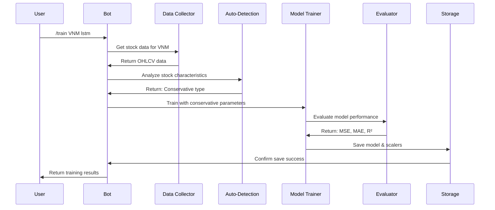

#### Expected Output / Kết Quả Mong Đợi

```
🤖 LSTM Model Training Complete - VNM

✅ Status: Training thành công
📊 Model Type: LSTM
📈 Performance:
• MSE: 2,345,678.1234
• MAE: 1,234.5678
• R²: 0.3456

💾 Model saved: models/lstm_model_VNM.h5
```

### Pre-Training vs Post-Training Comparison / So Sánh Trước và Sau Training

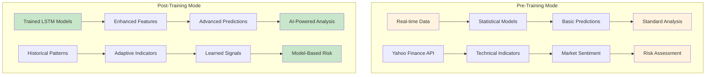

### Pre-Training Data Sources / Nguồn Dữ Liệu Trước Training

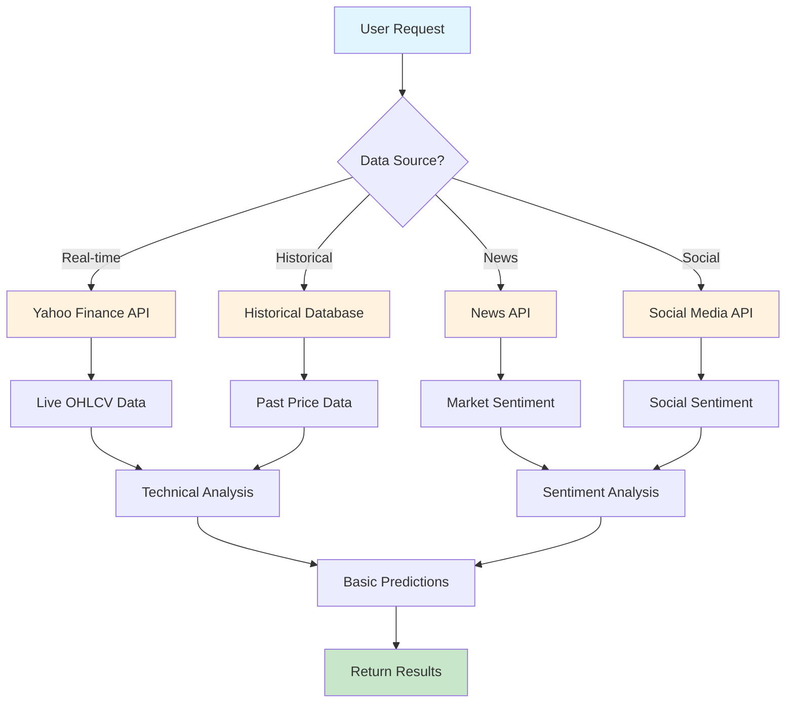

### Post-Training Functions Flow Chart / Biểu Đồ Chức Năng Sau Training

```mermaid
flowchart TD
    A[Trained LSTM Model] --> B{Function Type?}

    B -->|Price Prediction| C[/predict VNM lstm]
    B -->|Portfolio Analysis| D[/portfolio VNM ACB TCB]
    B -->|Trading Signals| E[/signals VNM]
    B -->|Risk Assessment| F[/risk VNM]
    B -->|Market Analysis| G[/market banking]

    C --> H[Load Model & Scalers]
    H --> I[Get Latest Data]
    I --> J[Make Prediction]
    J --> K[Return Price Forecast]

    D --> L[Load Multiple Models]
    L --> M[Analyze Portfolio Risk]
    M --> N[Return Diversification Advice]

    E --> O[Load Model & Data]
    O --> P[Generate Buy/Sell Signals]
    P --> Q[Return Trading Recommendations]

    F --> R[Load Model & Historical Data]
    R --> S[Calculate Risk Metrics]
    S --> T[Return Risk Assessment]

    G --> U[Load Sector Models]
    U --> V[Analyze Sector Trends]
    V --> W[Return Sector Analysis]

    style A fill:#e1f5fe
    style K fill:#c8e6c9
    style N fill:#c8e6c9
    style Q fill:#c8e6c9
    style T fill:#c8e6c9
    style W fill:#c8e6c9
```

#### Pre-Training vs Post-Training Examples / Ví Dụ Trước và Sau Training

**Pre-Training (Basic Mode):**

```bash
# Basic prediction without trained model
/predict VNM

# Expected output
🔮 Basic Prediction - VNM

📊 Current Price: 75,500 VND
🎯 Predicted Price: 75,800 VND (Statistical Model)
📈 Expected Change: +0.40%
⏰ Prediction Horizon: 1 day
⚠️ Confidence: Medium (Statistical Analysis)
```

**Post-Training (Enhanced Mode):**

```bash
# Advanced prediction with trained LSTM model
/predict VNM lstm

# Expected output
🔮 AI Prediction - VNM

📊 Current Price: 75,500 VND
🎯 Predicted Price: 76,200 VND (LSTM Model)
📈 Expected Change: +0.93%
⏰ Prediction Horizon: 1 day
🔄 Confidence: High (Trained Model)
📊 Model Performance: R² = 0.3456
```

### Detailed Code Comparison / So Sánh Chi Tiết Trong Code

#### Pre-Training Mode (`/predict VNM`)

**Data Processing:**

```python
# Basic data collection
data = self.vn_collector.get_vn_stock_data_yahoo(symbol, period="6mo")

# Simple technical indicators
data_with_indicators = self.analyzer.add_all_indicators(data)

# Basic prediction without trained model
prediction = self.predictor.predict(data, symbol, model_type='lstm')
```

**Features Used:**

- **Raw OHLCV**: Open, High, Low, Close, Volume
- **Basic Indicators**: RSI, MACD, Moving Averages
- **Simple Lag Features**: Price lag 1, 2, 3, 5, 10 days
- **Statistical Models**: Linear Regression, Random Forest

**Prediction Method:**

- **Fallback to Statistical Models**: Khi không có trained model
- **Simple Feature Engineering**: Lag features cơ bản
- **Standard Scaling**: StandardScaler cho features
- **Basic Confidence**: Fixed confidence level (0.8)

#### Post-Training Mode (`/predict VNM lstm`)

**Data Processing:**

```python
# Enhanced data collection with auto-detection
data = self.vn_collector.get_vn_stock_data_yahoo(symbol, period="6mo")

# Auto-detect stock characteristics
characteristics = self.analyze_stock_characteristics(data, symbol)

# Advanced features based on stock type
data_enhanced = self.prepare_data(data, symbol=symbol)

# Load trained LSTM model
model = tf.keras.models.load_model(f"lstm_model_{symbol}.h5")
scaler = joblib.load(f"lstm_scaler_{symbol}.pkl")
target_scaler = joblib.load(f"lstm_target_scaler_{symbol}.pkl")
```

**Features Used:**

- **Adaptive Features**: Dựa trên stock type (conservative/balanced/aggressive)
- **Enhanced Technical Indicators**: 20+ features với auto-detection
- **Advanced Sequences**: LSTM sequences với lookback period
- **Dual Scaling**: Feature scaling + Target scaling

**Prediction Method:**

- **Trained LSTM Model**: Custom model cho từng stock
- **Advanced Feature Engineering**: Auto-detected features
- **Sequence Processing**: LSTM input sequences
- **Model Performance**: R² score từ training

### Code Implementation Differences / Khác Biệt Trong Implementation

```python
# Pre-Training: Basic prediction
def predict_basic(self, data, symbol):
    # Simple feature engineering
    feature_cols = ['Open', 'High', 'Low', 'Close', 'Volume']

    # Basic lag features
    for col in feature_cols:
        for lag in [1, 2, 3, 5, 10]:
            data[f'{col}_lag_{lag}'] = data[col].shift(lag)

    # Statistical model fallback
    model = RandomForestRegressor()
    prediction = model.predict(X)

    return {
        'predicted_price': prediction[0],
        'confidence': 0.8,  # Fixed
        'model_type': 'statistical'
    }

# Post-Training: Advanced prediction
def predict_advanced(self, data, symbol):
    # Auto-detect characteristics
    characteristics = self.analyze_stock_characteristics(data, symbol)

    # Adaptive feature engineering
    X, _ = self.prepare_data(data, symbol=symbol)

    # Load trained model
    model = tf.keras.models.load_model(f"lstm_model_{symbol}.h5")
    scaler = joblib.load(f"lstm_scaler_{symbol}.pkl")
    target_scaler = joblib.load(f"lstm_target_scaler_{symbol}.pkl")

    # Advanced prediction
    X_scaled = scaler.transform(X)
    prediction_scaled = model.predict(X_scaled)
    prediction = target_scaler.inverse_transform(prediction_scaled)

    return {
        'predicted_price': prediction[0][0],
        'confidence': self.calculate_confidence(characteristics),
        'model_type': 'lstm',
        'model_performance': self.get_model_performance(symbol)
    }
```

#### Prediction / Dự Báo

```bash
# Predict with trained model
/predict VNM lstm

# Expected output
🔮 AI Prediction - VNM

📊 Current Price: 75,500 VND
🎯 Predicted Price: 76,200 VND
📈 Expected Change: +0.93%
⏰ Prediction Horizon: 1 day
```

#### Trading Signals / Tín Hiệu Giao Dịch

```bash
# Get trading signals
/signals VNM

# Expected output
📊 Trading Signals - VNM

🟢 BUY Signal
💰 Current Price: 75,500 VND
🎯 Target Price: 78,000 VND
📈 Expected Gain: +3.31%
⏰ Timeframe: 3-5 days
🔄 Confidence: 75%
```

#### Portfolio Analysis / Phân Tích Danh Mục

```bash
# Analyze portfolio
/portfolio VNM ACB TCB

# Expected output
📊 Portfolio Analysis

🔍 Risk Assessment:
• Overall Risk: Medium
• Diversification: Good
• Correlation: Low

💡 Recommendations:
• Add more defensive stocks
• Consider FPT for tech exposure
• Monitor VNM for entry points
```

### Tiếng Việt

Dưới đây là các ví dụ về cách sử dụng hệ thống training LSTM:

#### Training Cơ Bản

```bash
# Train mô hình LSTM cho VNM
/train VNM lstm

# Train mô hình LSTM cho ACB
/train ACB lstm

# Train mô hình LSTM cho cổ phiếu Mỹ
/train AAPL lstm
```

#### Kết Quả Mong Đợi

```
🤖 LSTM Model Training Complete - VNM

✅ Status: Training thành công
📊 Model Type: LSTM
📈 Performance:
• MSE: 2,345,678.1234
• MAE: 1,234.5678
• R²: 0.3456

💾 Model saved: models/lstm_model_VNM.h5
```

### Workflow Integration / Tích Hợp Quy Trình Làm Việc

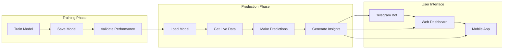

#### Dự Báo

```bash
# Dự báo với mô hình đã training
/predict VNM lstm

# Kết quả mong đợi
🔮 AI Prediction - VNM

📊 Current Price: 75,500 VND
🎯 Predicted Price: 76,200 VND
📈 Expected Change: +0.93%
⏰ Prediction Horizon: 1 day
```

#### Tín Hiệu Giao Dịch

```bash
# Lấy tín hiệu giao dịch
/signals VNM

# Kết quả mong đợi
📊 Trading Signals - VNM

🟢 TÍN HIỆU MUA
💰 Giá Hiện Tại: 75,500 VND
🎯 Giá Mục Tiêu: 78,000 VND
📈 Lợi Nhuận Mong Đợi: +3.31%
⏰ Khung Thời Gian: 3-5 ngày
🔄 Độ Tin Cậy: 75%
```

#### Phân Tích Danh Mục

```bash
# Phân tích danh mục
/portfolio VNM ACB TCB

# Kết quả mong đợi
📊 Phân Tích Danh Mục

🔍 Đánh Giá Rủi Ro:
• Rủi Ro Tổng Thể: Trung Bình
• Đa Dạng Hóa: Tốt
• Tương Quan: Thấp

💡 Khuyến Nghị:
• Thêm cổ phiếu phòng thủ
• Cân nhắc FPT cho tech
• Theo dõi VNM để vào lệnh
```

---

## Troubleshooting / Xử Lý Sự Cố

### Troubleshooting Flow Chart / Biểu Đồ Xử Lý Sự Cố

```mermaid
flowchart TD
    A[Issue Occurs] --> B{Issue Type?}

    B -->|Data Collection| C[Data Collection Issues]
    B -->|Training| D[Training Issues]
    B -->|Model Loading| E[Model Loading Issues]

    C --> F["Cannot get data for VNM"]
    C --> G["Empty DataFrame returned"]

    F --> H[Check internet connection]
    F --> I[Verify symbol format]
    F --> J[Try alternative sources]

    G --> K[Check symbol validity]
    G --> L[Try different periods]
    G --> M[Verify market type]

    D --> N["Shape mismatch error"]
    D --> O["NaN values in data"]
    D --> P["Poor R² score"]

    N --> Q[Check data shapes]
    N --> R[Verify parameters]
    N --> S[Check feature selection]

    O --> T[Improve data cleaning]
    O --> U[Check source data]
    O --> V[Adjust fill strategy]

    P --> W[Try different features]
    P --> X[Adjust architecture]
    P --> Y[Increase epochs]

    E --> Z["Model file not found"]
    E --> AA["Scaler compatibility error"]

    Z --> BB[Verify save success]
    Z --> CC[Check file paths]
    Z --> DD[Check naming convention]

    AA --> EE[Ensure scaler match]
    AA --> FF[Check file integrity]
    AA --> GG[Retrain if needed]

    style A fill:#ffcdd2
    style H fill:#c8e6c9
    style I fill:#c8e6c9
    style J fill:#c8e6c9
    style K fill:#c8e6c9
    style L fill:#c8e6c9
    style M fill:#c8e6c9
    style Q fill:#c8e6c9
    style R fill:#c8e6c9
    style S fill:#c8e6c9
    style T fill:#c8e6c9
    style U fill:#c8e6c9
    style V fill:#c8e6c9
    style W fill:#c8e6c9
    style X fill:#c8e6c9
    style Y fill:#c8e6c9
    style BB fill:#c8e6c9
    style CC fill:#c8e6c9
    style DD fill:#c8e6c9
    style EE fill:#c8e6c9
    style FF fill:#c8e6c9
    style GG fill:#c8e6c9
```

### English

Common issues and solutions:

#### Data Collection Issues / Vấn Đề Thu Thập Dữ Liệu

**Problem**: "Cannot get data for VNM"
**Solution**:

- Check internet connection
- Verify symbol format (VNM.VN for Yahoo Finance)
- Try alternative data sources

**Problem**: "Empty DataFrame returned"
**Solution**:

- Check symbol validity
- Try different time periods
- Verify market (VN vs US)

#### Training Issues / Vấn Đề Training

**Problem**: "Shape mismatch error"
**Solution**:

- Ensure consistent data shapes
- Check lookback and prediction_horizon parameters
- Verify feature selection

**Problem**: "NaN values in data"
**Solution**:

- Improve data cleaning process
- Check for missing values in source data
- Adjust forward/backward fill strategy

**Problem**: "Poor R² score"
**Solution**:

- Try different feature combinations
- Adjust model architecture
- Increase training epochs
- Check data quality

#### Model Loading Issues / Vấn Đề Tải Mô Hình

**Problem**: "Model file not found"
**Solution**:

- Verify model was saved successfully
- Check file paths and permissions
- Ensure consistent naming convention

**Problem**: "Scaler compatibility error"
**Solution**:

- Ensure scalers match training data
- Check scaler file integrity
- Retrain model if necessary

### Tiếng Việt

Các vấn đề thường gặp và giải pháp:

#### Vấn Đề Thu Thập Dữ Liệu

**Vấn đề**: "Không thể lấy dữ liệu cho VNM"
**Giải pháp**:

- Kiểm tra kết nối internet
- Xác minh định dạng symbol (VNM.VN cho Yahoo Finance)
- Thử nguồn dữ liệu thay thế

**Vấn đề**: "DataFrame trống"
**Giải pháp**:

- Kiểm tra tính hợp lệ của symbol
- Thử các khoảng thời gian khác nhau
- Xác minh thị trường (VN vs US)

#### Vấn Đề Training

**Vấn đề**: "Lỗi shape mismatch"
**Giải pháp**:

- Đảm bảo shape dữ liệu nhất quán
- Kiểm tra tham số lookback và prediction_horizon
- Xác minh feature selection

**Vấn đề**: "Giá trị NaN trong dữ liệu"
**Giải pháp**:

- Cải thiện quy trình làm sạch dữ liệu
- Kiểm tra giá trị thiếu trong dữ liệu nguồn
- Điều chỉnh chiến lược forward/backward fill

**Vấn đề**: "R² score thấp"
**Giải pháp**:

- Thử các kết hợp features khác nhau
- Điều chỉnh kiến trúc mô hình
- Tăng số epochs training
- Kiểm tra chất lượng dữ liệu

#### Vấn Đề Tải Mô Hình

**Vấn đề**: "Không tìm thấy file mô hình"
**Giải pháp**:

- Xác minh mô hình đã được lưu thành công
- Kiểm tra đường dẫn file và quyền truy cập
- Đảm bảo quy ước đặt tên nhất quán

**Vấn đề**: "Lỗi tương thích scaler"
**Giải pháp**:

- Đảm bảo scalers khớp với dữ liệu training
- Kiểm tra tính toàn vẹn file scaler
- Training lại mô hình nếu cần thiết

---

## Conclusion / Kết Luận

### English

The LSTM Training Flow is a sophisticated, adaptive system that automatically optimizes training parameters based on stock characteristics. The auto-detection system ensures that each stock receives the most appropriate features, model architecture, and training parameters, leading to improved prediction accuracy and model performance.

Key benefits:

- **Automatic Adaptation**: No manual configuration required
- **Scalable**: Works with any stock symbol
- **Intelligent**: Self-optimizing based on stock characteristics
- **Consistent**: Same high-quality approach for all stocks

### Tiếng Việt

Quy Trình Training LSTM là một hệ thống tinh vi, tự động thích ứng tối ưu hóa tham số training dựa trên đặc điểm cổ phiếu. Hệ thống tự động phân tích đảm bảo mỗi cổ phiếu nhận được features, kiến trúc mô hình, và tham số training phù hợp nhất, dẫn đến cải thiện độ chính xác dự báo và hiệu suất mô hình.

Lợi ích chính:

- **Tự Động Thích Ứng**: Không cần cấu hình thủ công
- **Có Thể Mở Rộng**: Hoạt động với bất kỳ mã cổ phiếu nào
- **Thông Minh**: Tự tối ưu hóa dựa trên đặc điểm cổ phiếu
- **Nhất Quán**: Cùng approach chất lượng cao cho tất cả cổ phiếu

---

_Document Version: 1.0_  
_Last Updated: December 2024_  
_Author: AlphaPulseBot Development Team_
